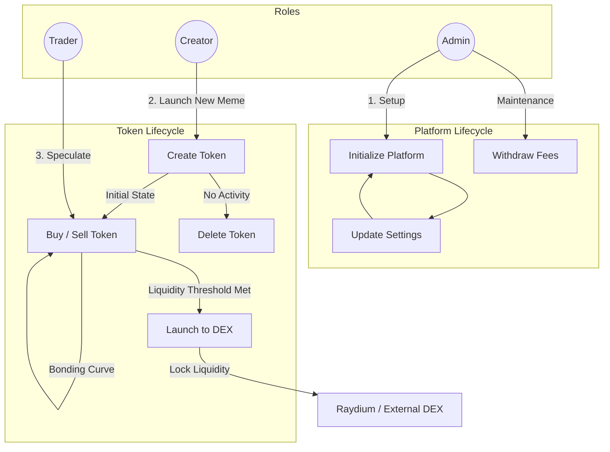

# Meme Launchpad Solana Program

## Overview
This project is a Solana smart contract suite for launching meme tokens with automated bonding curve pricing, fee distribution, and DEX integration. It is built using Anchor and supports SPL Token-2022.

## Core Functionalities
- **Token Creation:** Users can create new meme tokens with custom name, symbol, URI, decimals, and initial supply. Each token is managed by a bonding curve for dynamic pricing.
- **Bonding Curve:** The bonding curve contract manages token price and liquidity, allowing users to buy and sell tokens at algorithmically determined prices.
- **Buy/Sell Tokens:** Users can buy or sell meme tokens. The contract calculates the price, burns/mints tokens, and transfers SOL accordingly. Platform and creator fees are automatically distributed.
- **Fee Distribution:** Platform and creator fees are deducted from each transaction and sent to the respective accounts.
- **DEX Launch:** Tokens can be launched to a DEX after initial trading, locking further bonding curve operations.
- **Transaction Logging:** Every buy/sell is recorded with details for transparency and analytics.

## User Flow
1. **Create Token:**
   - User calls `create_token` with desired parameters.
   - Contract initializes a new mint and bonding curve account.
   - Token info is stored and ready for trading.
2. **Buy Token:**
   - User calls `buy_token` with token ID and amount.
   - Contract calculates price, mints tokens, and transfers SOL.
   - Fees are distributed, and transaction is logged.
3. **Sell Token:**
   - User calls `sell_token` with token ID and amount.
   - Contract calculates output, burns tokens, and transfers SOL.
   - Fees are distributed, and transaction is logged.
4. **Launch to DEX:**
   - Token creator can launch the token to a DEX.
   - Bonding curve trading is disabled; DEX trading is enabled.

## Accounts
- **ProgramState:** Global settings and platform fee rates.
- **TokenInfo:** Metadata and state for each meme token.
- **BondingCurve:** Pricing and liquidity management for each token.
- **Transaction:** Records of each buy/sell event.

## Architecture Diagram




## Security
- All critical operations are validated.
- CPI calls are used for mint and token operations.
- Safety checks and doc comments are included for unchecked accounts.

## Getting Started
1. Install Anchor and Solana CLI.
2. Clone the repo and run `anchor build`.
3. Deploy to your Solana cluster.
4. Interact using Anchor client or your own frontend.

---

## Code Samples

### Token Creation
```rust
pub fn create_token(
    ctx: Context<CreateTokenCtx>,
    name: String,
    symbol: String,
    uri: String,
    decimals: u8,
    initial_supply: u64,
) -> Result<()> {
    // ...validation and state updates...
    let cpi_accounts = InitializeMint2 {
        mint: ctx.accounts.mint.to_account_info(),
    };
    let cpi_program = ctx.accounts.token_program.to_account_info();
    let cpi_ctx = CpiContext::new(cpi_program, cpi_accounts);
    token_2022::initialize_mint2(
        cpi_ctx,
        decimals,
        &bonding_curve.key(),
        None,
    )?;
    // ...populate TokenInfo and BondingCurve...
    Ok(())
}
```

### Buy Token
```rust
pub fn buy_token(
    ctx: Context<BuyTokenCtx>,
    token_id: u64,
    token_amount: u64,
) -> Result<()> {
    // ...validation and price calculation...
    let mint_to_accounts = MintTo {
        mint: ctx.accounts.mint.to_account_info(),
        to: ctx.accounts.buyer_token_account.to_account_info(),
        authority: ctx.accounts.bonding_curve.to_account_info(),
    };
    let mint_to_ctx = CpiContext::new_with_signer(
        ctx.accounts.token_program.to_account_info(),
        mint_to_accounts,
        signer_seeds,
    );
    token_2022::mint_to(mint_to_ctx, token_amount)?;
    // ...transfer SOL, update state, log transaction...
    Ok(())
}
```

### Sell Token
```rust
pub fn sell_token(
    ctx: Context<SellTokenCtx>,
    token_id: u64,
    token_amount: u64,
) -> Result<()> {
    // ...validation and price calculation...
    let burn_accounts = Burn {
        mint: ctx.accounts.mint.to_account_info(),
        from: ctx.accounts.seller_token_account.to_account_info(),
        authority: ctx.accounts.seller.to_account_info(),
    };
    let burn_ctx = CpiContext::new(
        ctx.accounts.token_program.to_account_info(),
        burn_accounts,
    );
    token_2022::burn(burn_ctx, token_amount)?;
    // ...transfer SOL, update state, log transaction...
    Ok(())
}
```
# klick
